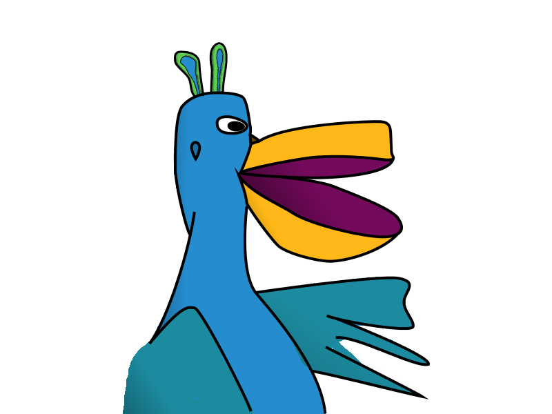

# Talkatu

Talkatu is a collection of GTK4 widgets that are useful for chat applications.

It was started as a rewrite of the GtkIMHTML widget found in Pidgin, but
quickly expanded to include most things related to conversation windows.

This is highly experimental right now and might eat babies, we're not sure
yet. So proceed with caution :-D

## Name

The name is a pun of talkatoo from Super Mario Odyssey which just so happens
to also say "talk at u" :-D

## Dependencies

Currently Talkatu depends on

 * glib-2.0 >= 2.40.0
 * gtk-4.0 >= 4.6.0
 * gladeui-2.0 >= 3.0.0
 * gumbo >= 0.10
 * libcmark

## Internationalization

All of our internationalization work is done via the
[Talkatu](https://www.transifex.com/pidgin/talkatu/dashboard/) project under
the [Pidgin organization](https://www.transifex.com/pidgin/) on
[Transifex](https://www.transifex.com).  If you would like to contribute
that's the place to do it.

